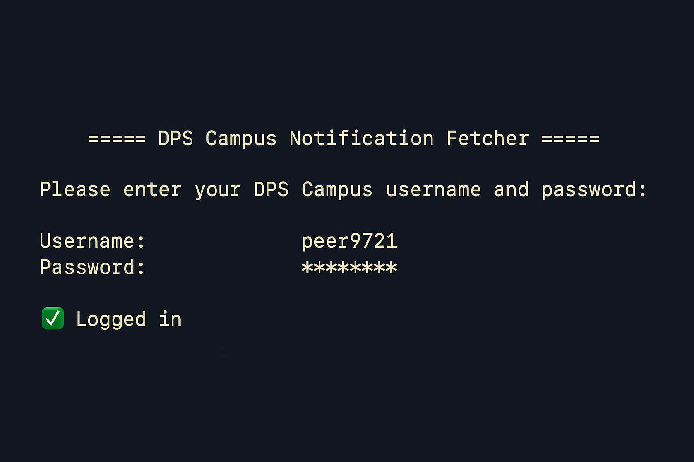
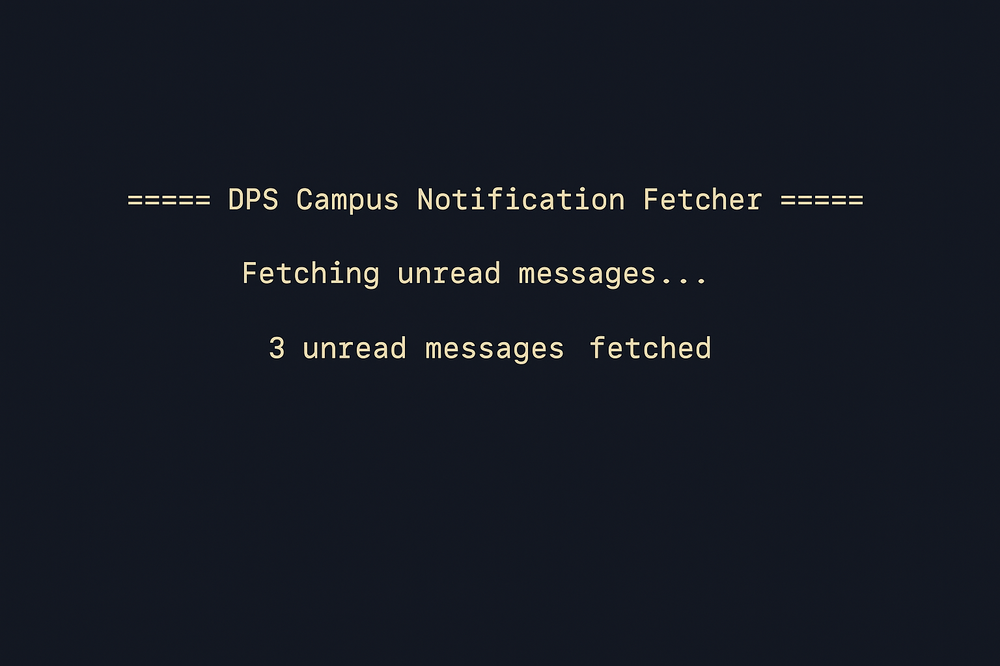
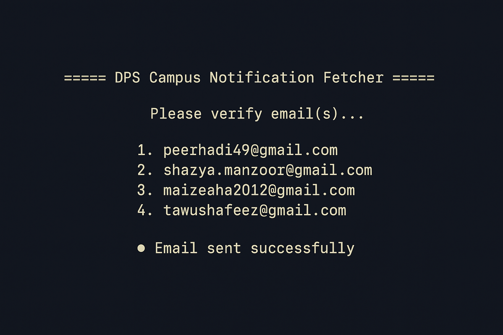

# 📬 DPS Campus Message Calendar CLI

A clean and smart CLI tool that logs into the DPS Srinagar Campus portal, scrapes your unread messages, extracts calendar event information using Gemini 1.5 Flash (Google's AI), and sends you an `.ics` calendar file via email. ✨


---

## ✨ Features

- 🔐 Secure login using your DPS Campus credentials
- 📥 Automatically fetches **all unread messages**
- 🧠 Uses **AI** to extract events and dates from messages
- 🗓️ Converts extracted events to **calendar format (.ics)**
- 📧 Sends calendar to selected email addresses

---

## 📸 Screenshots

| Login Prompt | Message Scraping | Email Delivery |
|--------------|------------------|----------------|
|  |  |  |

---

## 🚀 Quick Start

### 1. Clone the Repo

```bash
git clone https://github.com/yourname/dps-campus-calendar-cli.git
cd dps-campus-calendar-cli
```

### 2. Install Dependencies

```bash
npm install
```

### 3. Set Environment Variables

Create a `.env` file with your Gemini API key:

```env
GEMINI_API_KEY=your_api_key_here
```

### 4. Run the App

```bash
ts-node index.ts
```

---

## 📤 Email Options

You’ll be prompted to send the calendar to one or more of these:

1. `peerhadi49@gmail.com`
2. `shazya.manzoor@gmail.com`
3. `maizahtaha2012@gmail.com`
4. `tawushafeez@gmail.com`

---

## ⚙️ Built With

- `axios` & `cheerio` — Web scraping
- `ics` — Calendar creation
- `@google/generative-ai` — Gemini 1.5 Flash integration
- `dotenv` — Config handling
- `nodemailer` — Email delivery
- `typescript` — CLI logic

---

## 🧠 AI-Powered Parsing

Gemini intelligently extracts only meaningful, upcoming events from messages using a smart natural language prompt.

---

## 📅 Output Example

```ics
BEGIN:VEVENT
SUMMARY:Spell Test - Social Science
DTSTART:20250623T080000Z
DESCRIPTION:Chapter: Institutions of Democracy
DURATION:PT1H
END:VEVENT
```

---

## 📃 License

MIT — Free to use and contribute.
